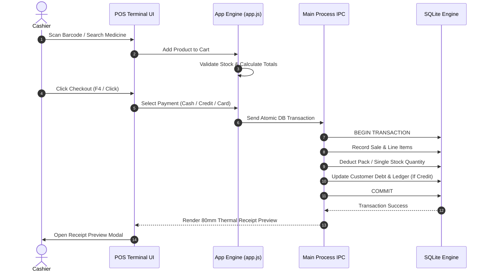

<div align="center">

# 🏥 MediDesk POS & Pharmacy Management System

### *Enterprise-Grade, Offline-First Desktop POS & Inventory Management Software*

[](https://nodejs.org/)
[](https://www.electronjs.org/)
[](https://www.sqlite.org/)
[](https://www.microsoft.com/windows)
[](LICENSE)
[](https://github.com/SyedBrothers/medidesk-pos/releases)

---

<p align="center">
  <b>MediDesk POS</b> is a high-performance, offline-first Desktop POS & Pharmacy Management application built with Node.js, Electron, HTML5/CSS3 glassmorphism, and an embedded SQLite WASM database engine. Optimized for ultra-fast performance on 32-bit (ia32) and 64-bit (x64) Windows machines.
</p>

[⬇️ Download Latest Installer (.exe)](https://github.com/SyedBrothers/medidesk-pos/releases) • [📖 Documentation](#-system-architecture) • [🚀 Quick Start](#-quick-start--installation)

</div>

---

## 🌟 Key Highlights & Features

| Feature Module | Description & Capabilities |
| :--- | :--- |
| **⚡ Offline-First SQLite Engine** | Operates 100% offline with zero cloud latency. Embedded WASM SQLite database with high-performance indices. |
| **📦 Product-Centric Inventory** | Unified inventory management for **Packs** and **Single Loose Tablets** with automatic unit calculations. |
| **💳 Customer Khata (Credit Ledger)** | Complete credit account management, debt tracking, credit limit enforcement, and A4 ledger PDF statements. |
| **🖨️ Thermal Receipts & Reprinting** | Built-in 80mm thermal receipt printing, receipt reprinting from log, and optional prescription attachment. |
| **🔒 Security & Role-Based PIN Lock** | Terminal PIN authentication (Admin, Manager, Cashier) supporting physical keyboard and numpad entry. |
| **⚠️ 6-Month Expiry Warning Board** | Automated expiry tracking highlighting stock expiring in 30, 90, and 180 days with stock discard actions. |
| **🚚 Supplier Purchase Order Builder** | Filter inventory by supplier, generate restock orders, and build formal Purchase Order (PO) documents. |
| **📊 Real-Time Analytics Dashboard** | Executive metrics, daily sales trend charts, payment distribution breakdown, and top-demanding product leaderboards. |

---

## 📐 System Architecture

MediDesk POS uses a multi-process Electron architecture isolating system hardware IPC calls from UI rendering.

```mermaid
graph TD
    subgraph Client UI Layer (Renderer)
        A["HTML5 / CSS3 Glassmorphism UI"] --> B["JavaScript App Engine (app.js)"]
        B --> C["Client-Side Pagination (25 items/page)"]
        B --> D["Toast Notification & Focus Manager"]
    end

    subgraph Secure IPC Bridge Layer
        E["Context-Isolated Preload Bridge (preload.js)"]
        B <--> E
    end

    subgraph Desktop Core Engine (Main Process)
        F["Electron Main Process (main.js)"]
        E <--> F
        F --> G["SQLite WASM Engine (sql.js)"]
        F --> H["Debounced Disk Persistence"]
        F --> I["Native Windows Print Service"]
    end

    subgraph Local File System Storage
        G <--> J[("medidesk_pos.db (SQLite)")]
        H --> K["/Documents/MediDeskPOS/Backups"]
        F --> L["/Documents/MediDeskPOS/Prescriptions"]
    end
```

---

## 🔄 Transaction & POS Checkout Flow



---

## ⌨️ Global Keyboard Shortcuts

| Shortcut Key | Action | Description |
| :---: | :--- | :--- |
| **`Enter`** *(in Search)* | Add Exact Match / Barcode | Instantly adds matched medicine barcode to cart |
| **`F1`** | Focus POS Search | Instantly focuses the product search input field |
| **`F4`** | Open Checkout Modal | Opens cash payment / credit checkout drawer |
| **`ESC`** | Close Active Modal | Closes any open modal overlay and restores active input focus |
| **`0 - 9`** / **`Numpad`** | Physical Keyboard PIN Entry | Enter 4-digit terminal unlock code via keyboard or touchscreen |

---

## 🚀 Quick Start & Installation

### Option 1: Download Ready-to-Run Windows Installer (Recommended)

1. Navigate to the [**GitHub Releases Page**](https://github.com/SyedBrothers/medidesk-pos/releases).
2. Download the latest `MediDesk-POS-Setup-x.x.x.exe`.
3. Double-click the `.exe` file to install and run the application.

---

### Option 2: Local Developer Setup

#### Prerequisites
- [Node.js (v18.x or higher)](https://nodejs.org/)
- [Git](https://git-scm.com/)

#### Installation Steps

```bash
# 1. Clone the GitHub repository
git clone https://github.com/SyedBrothers/medidesk-pos.git

# 2. Navigate to the project directory
cd medidesk-pos

# 3. Install project dependencies
npm install

# 4. Launch the desktop app in development mode
npm start
```

#### Build Windows Installer (.exe) Locally

```bash
# Build 32-bit and 64-bit Windows NSIS setup installers & portable executables
npm run build
```

The output installer files will be generated inside the `dist/` directory.

---

## ⚙️ Automated GitHub Actions CI/CD Release System

This repository includes a GitHub Actions workflow (`.github/workflows/build-release.yml`).

When you create and push a tag starting with `v` (e.g. `v1.0.0` or `v1.1.0`), GitHub Actions automatically:
1. Sets up a clean Windows build environment.
2. Compiles the Electron source code using `electron-builder`.
3. Generates the 32-bit and 64-bit NSIS installer setup executables.
4. Publishes a new release on GitHub Releases with the `.exe` binaries attached.

```bash
# Example: Triggering an automated release build on GitHub
git tag -a v1.1.0 -m "Release version 1.1.0"
git push origin v1.1.0
```

---

## 🔐 Default Access PIN Codes

| Role | Name | Default Security PIN |
| :--- | :--- | :---: |
| **Admin** | Syed Brothers | `1234` |
| **Manager** | Senior Pharmacist | `5678` |
| **Cashier** | Terminal Cashier | `0000` |

---

## 📄 License

Distributed under the MIT License. See [`LICENSE`](LICENSE) for more information.

---

<div align="center">
  <sub>Built with ❤️ for modern pharmacies and retail businesses.</sub>
</div>
